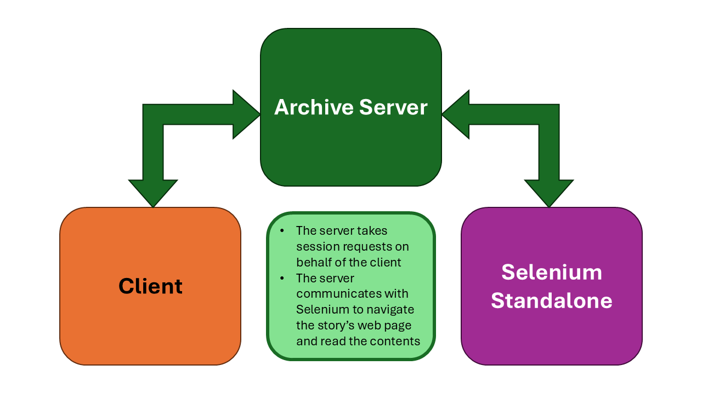
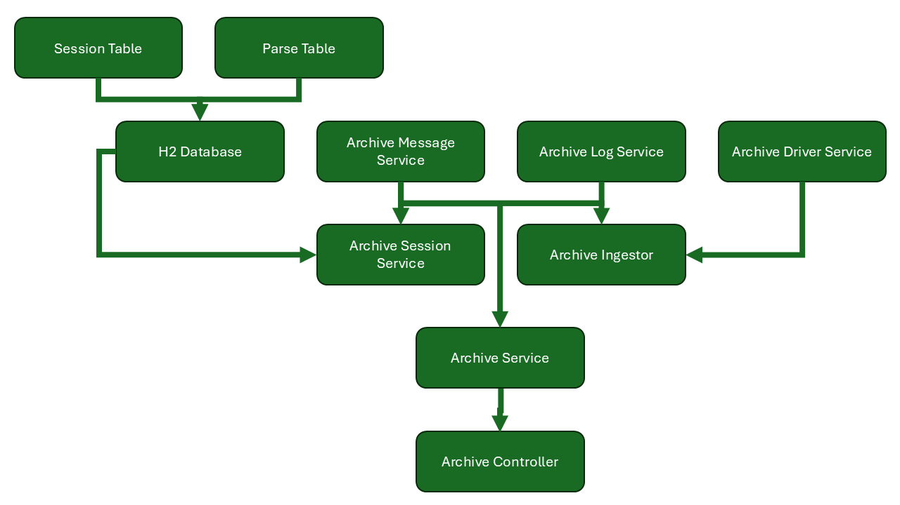
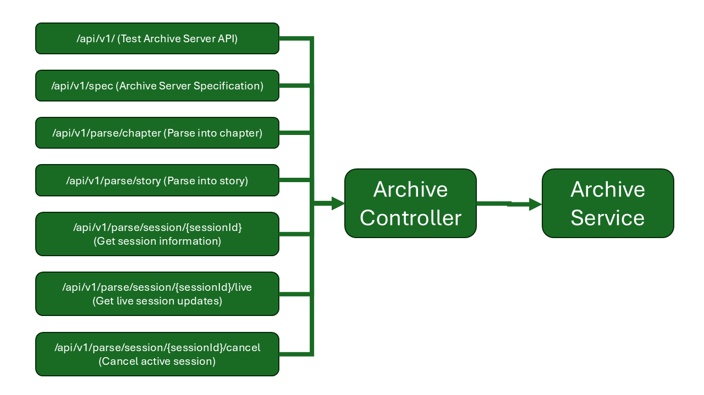
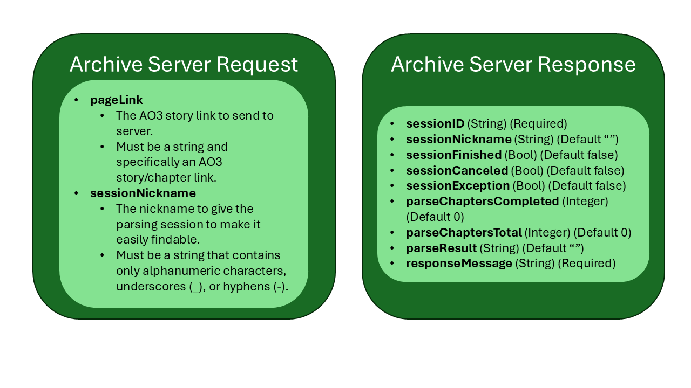

= Archive Ingestor Server
:author: Laolu Adewoye
:email: laoluadewoye@gmail.com>
:description: Java-based application for parsing my fan-fiction and distributing the information in the form of JSON.
:keywords: container, docker, java, testing, junit, maven, ao3, web, selenium, parsing, spring boot, postman, h2, asynchronous, threads, stories, chapters, logging, messaging
:toc:

include::version_control.adoc[]

== Software Bill of Materials

. Docker Desktop
. Java Runtime Environment 8
. Open JDK 25.0.1
. Maven 3.9.11
. Selenium Standalone Chrome image (version 136.0-20251101)
.. Docker command to run image is `docker run -d -p 4444:4444 -p 7900:7900 --shm-size="2g" selenium/standalone-chrome:136.0-20251101`

== Explanation

This part of the project is the Spring Boot application that I will use to obtain and distribute Ao3 story information. It was first developed as a POJO Java Package that can be used with additional code to process Ao3 stories using Selenium, then the Spring Boot backend was built around the package through numerous architectural changes and rounds of testing.

The architecture is displayed in the visuals and text below:

=== External Communication Archive Server Does between Client and Selenium

In this case, the client can be anything from the Angular GUI web frontend (such as the one in the story-ingestor-frontend folder) to any old server or client that is capable of communicating through a REST API. The diagram also indicates that a selenium container must be running for the server to be able to parse information.

=== Hierarchy of Spring Dependency Injections in Archive Server

=== V1 API Branches Supported by Archive Controller

The first important thing to note here is that every API point except for "/api/v1/parse/chapter" and "/api/v1/parse/story" are simply *GET request based* endpoints. The chapter and story parsing endpoints are *POST request based*, and require the submission of a *request body*.

The second important thing to note here is that the "/api/v1/parse/session" branch of endpoints are *content-addressable*, meaning that when a session ID is received from the server, one can use that session ID to retrieve session information or cancel the session altogether. Just place your session ID where you see the "*\{sessionId}*" placeholder in the API.

=== Schema for JSON Request and Response Bodies

=== Story Info Schema for JSON Parse Result

Metadata about the story is contained in this object, and is the first thing created whenever parsing a chapter or story.

==== Metadata about the metadata

. creationTimestamp (String) -> The date and time the story info object was created in UTC.
. creationHash (String) -> The unique identifier of the story info object.

==== Information you would find in the table

. ratings (List of Strings) -> The various AO3 ratings the story has.
. warnings (List of Strings) -> The various AO3 warnings the story has.
. categories (List of Strings) -> The various AO3 categories the story has.
. fandoms (List of Strings) -> The various fandoms the story is in.
. relationships (List of Strings) -> The various character relationships contained in the story.
. characters (List of Strings) -> The various characters present in the story.
. additionalTags (List of Strings) -> The rest of the tags the story has.
. language (String) -> The primary language of the story.
. series (List of Strings) -> The series the story are present in.
. collections (List of Strings) -> The collections the story are present in.
. published (String) -> The date when the story was published.
. status (String) -> The completion status of the story.
. statusWhen (String) -> The date when the story was last updated.
. words (Integer) -> The amount of words in the story.
. currentChapters (Integer) -> The current amount of chapters in the story.
. totalChapters(Integer) -> The total amount of chapters in the story.
. comments (Integer) -> The total amount of comments the story has.
. kudos (Integer) -> The total amount of kudos the story has.
. bookmarks (Integer) -> The total amount of bookmarks the story has.
. hits (Integer) -> The total amount of hits the story has.

==== Story preface information

. title (String) -> The title of the story.
. authors (List of Strings) -> The author(s) of the story.
. summary (List of Strings) -> The summary of the story by line.
. associations (List of Strings) -> The associations of the story (high key forgot what this meant).
. startNotes (List of Strings) -> The starting notes of a story (Not to be confused with chapter-specific notes).
. endNotes (List of Strings) -> The end notes of a story (Not to be confused with chapter-specific notes).

==== Kudos and Bookmark tracking

. registeredKudos (List of Strings) -> List of users who left kudos on a story.
. unnamedRegisteredKudos (Integer) -> Count of kudos that were left by users who aren't guests or named in the registered kudos analysis.
. guestKudos (Integer) -> Count of kudos that were left by guests.
. publicBookmarks (List of Strings) -> List of users who bookmarked the story.

=== Comment Schema for JSON Parse Result

Information specific to a chapter is contained here. If a comment has replies, the comment will contain a list of other comment objects representing the replies.

==== Metadata about the metadata

. creationTimestamp (String) -> The date and time the story info object was created in UTC.
. creationHash (String) -> The unique identifier of the story info object.

==== Comment information

. user (String) -> The user who made the comment.
. posted (String) -> The date and time the comment was posted.
. text (List of Strings) -> The comment text.
. depth (Integer) -> The reply depth of the comment.
. page (Integer) -> The page the comment was found on.
. replies (List of Comment Objects) -> The replies to the comment.

=== Chapter Schema for JSON Parse Result

Information specific to a chapter is contained here, along with a reference to the story information if the chapter isn't wrapped in a greater story object.

==== Metadata about the metadata

. creationTimestamp (String) -> The date and time the story info object was created in UTC.
. creationHash (String) -> The unique identifier of the story info object.

==== Chapter information

. parentArchiveStoryInfo (Optional Reference) -> The story info object contained here. Only here if only a specific chapter was requested to be parsed.
. pageTitle (String) -> The page title that the chapter was parsed from.
. pageLink (String) -> The page link that the chapter was parsed from.
. chapterTitle (String) -> The title of the chapter.
. summary (List of Strings) -> The summary of the chapter (not to be confused with story-wide summary).
. startNotes (List of Strings) -> The starting notes of the chapter (not to be confused with story-wide start notes).
. endNotes (List of Strings) -> The ending notes of the chapter (not to be confused with story-wide end notes).
. paragraphs (List of Strings) -> The paragraphs of the chapter.
. comments (List of Comment Objects) -> A list of comments with threads.

=== Story Schema for JSON Parse Result

The story object is more of a wrapper of everything than its own entity, so it's contents are summed up with this picture. It also has its own creation timestamp and hash, holds the story information directly, and contains a list which holds the chapters in order.

image::archive_story_schema.png[]

Just in case, though-

==== Metadata about the metadata

. creationTimestamp (String) -> The date and time the story info object was created in UTC.
. creationHash (String) -> The unique identifier of the story info object.

==== Story reference objects

. archiveStoryInfo (Reference) -> Contains the story info object defined above.
. archiveChapters (List of chapter references) -> Contains a list of chapter objects whose schema are defined above.

== Configuration

The following settings have been used for this server at the Spring Boot level.

[source]
----
include::src/main/resources/application.properties[]
----

These settings are made available in the JVM that runs this application. To change any of these settings, pass it as a command line argument when running the docker container or jar file.

== Usage

(Finish this later)
